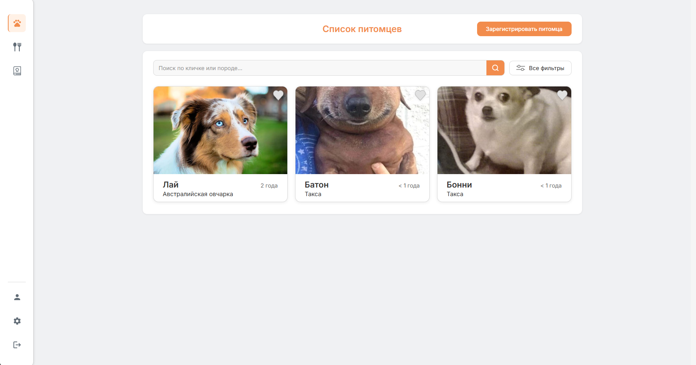
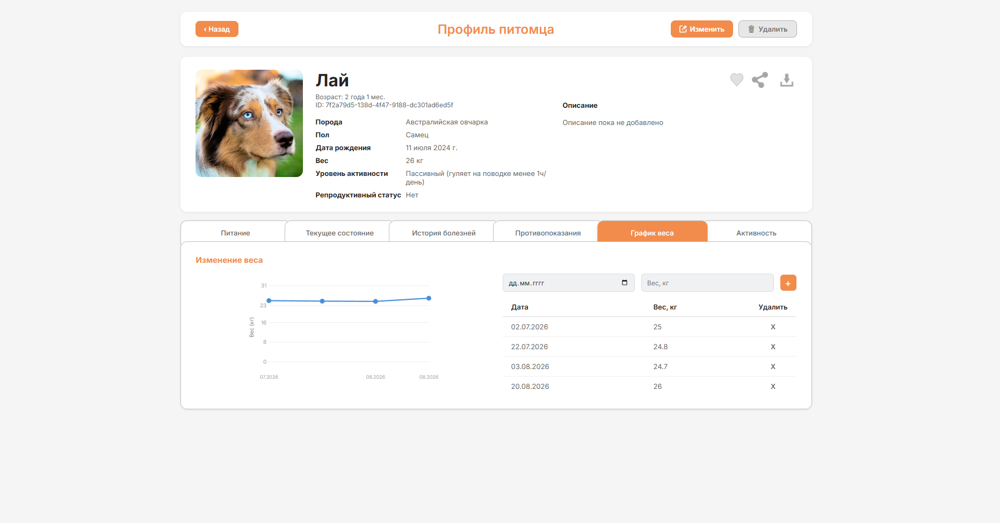
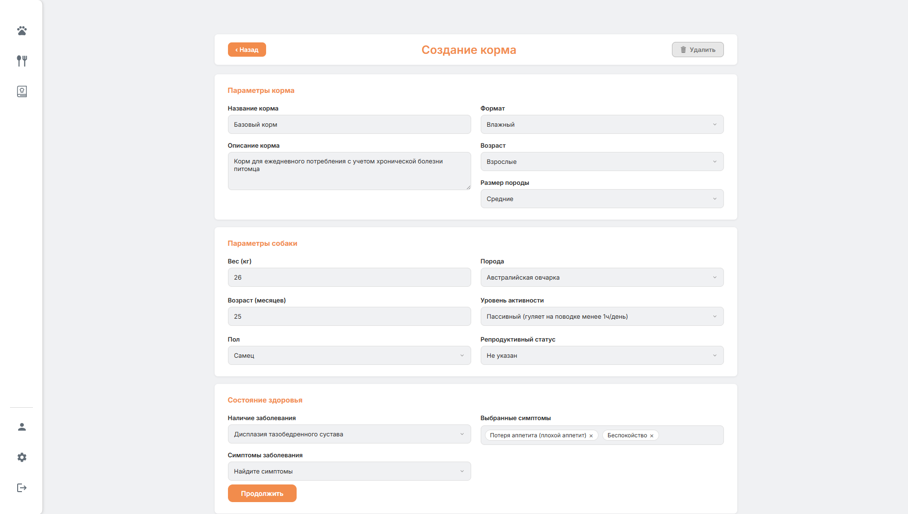
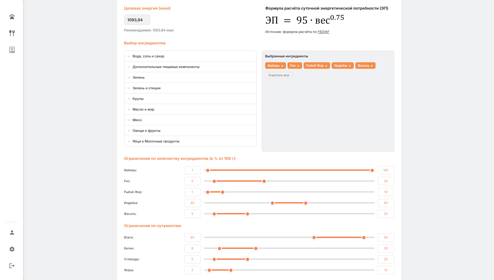
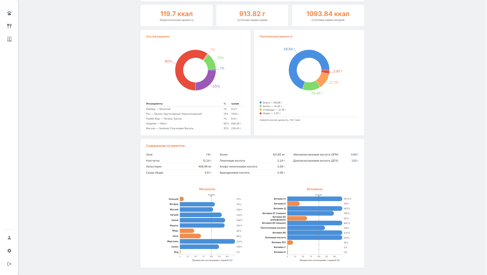

  <h1>PetFood Platform</h1>

  
<strong>Personalized nutrition planning for healthier, happier pets.</strong>

  

    <a href="#about">About</a> ·
    <a href="#features">Features</a> ·
    <a href="#how-it-works">How it works</a> ·
    <a href="#product-walkthrough">Walkthrough</a> ·
    <a href="#product-experience">Product experience</a>
  

## About

PetFood Platform helps pet owners organize everything needed for thoughtful
everyday nutrition. It brings pet profiles, health context, ingredients, and
food recipes together in one clear workspace.

Instead of keeping important details in different notes and calculating meals
manually, owners can build a complete pet profile, select suitable ingredients,
create recipes, and review their nutritional composition before saving them.

  

<em>Keep every pet close at hand from one focused dashboard.</em>

## Features

### Pet profiles

Keep each pet's essential information in one place, including breed, age,
weight, activity level, photo, and other individual characteristics.

### Health context

Maintain a structured view of the pet's current condition,
contraindications, and disease history so that important context is always
close to the nutrition workflow.

### Ingredient library

Browse available ingredients, inspect their nutritional values, search and
filter the catalog, and create private custom ingredients when something is
missing from the shared library.

### Recipe builder

Combine ingredients in a guided workflow, adjust quantities, associate a
recipe with the right pet, and keep personal recipes organized for future use.

### Nutritional calculations

Calculate calorie and nutrient targets, review the composition of a recipe,
and explore adjustments before saving the final version.

### Personal workspace

Pet profiles, custom ingredients, photos, and recipes remain connected to
their owner. Account settings and profile management are available directly
inside the application.

## How it works

1. **Create a pet profile** with the details that make the pet unique.
2. **Add health context** such as current conditions and contraindications.
3. **Choose ingredients** from the library or create your own.
4. **Build and calculate a recipe** based on the pet's profile.
5. **Save the result** and return to it whenever the recipe needs an update.

## Product walkthrough

### See the complete pet profile

Move from basic information to health history, contraindications, activity,
nutrition, and weight tracking without leaving the pet's profile.

  

### Build around the pet

Start a recipe around its purpose, then account for the pet's age, breed,
activity, reproductive status, conditions, and symptoms.

  

### Choose ingredients and set targets

Select ingredients, review the daily energy target, and define acceptable
ranges for ingredient quantities and key nutrients.

  

### Understand the result

Review the finished ration, energy values, nutrient composition, minerals, and
vitamins in a visual summary designed for quick comparison.

  

## Product experience

- A focused dashboard for navigating pets and their information.
- Search and filters for working with growing ingredient and recipe lists.
- Visual charts that make recipe composition easier to understand.
- Light and dark themes for comfortable everyday use.
- Russian, English, and Kazakh interface languages.
- Responsive screens for working across different device sizes.

The platform supports nutrition planning and organization. It does not replace
professional veterinary diagnosis or treatment.
